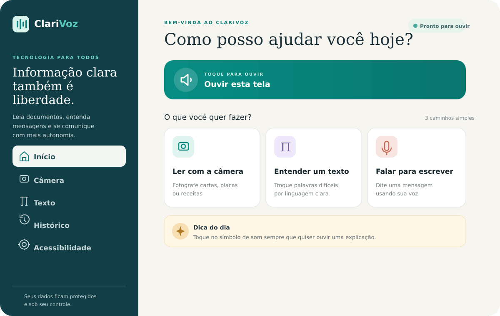
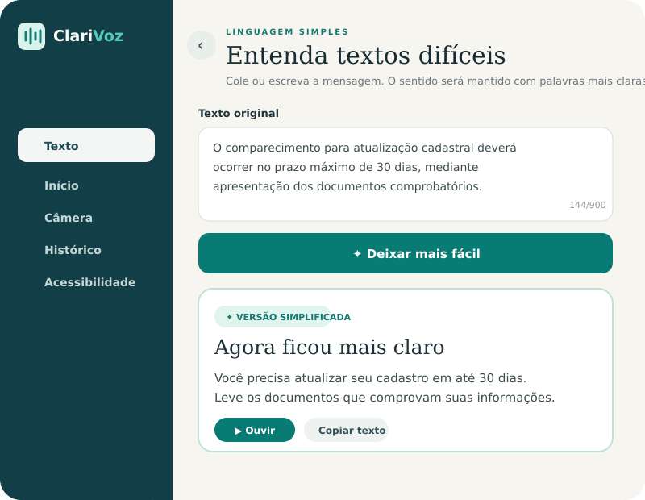
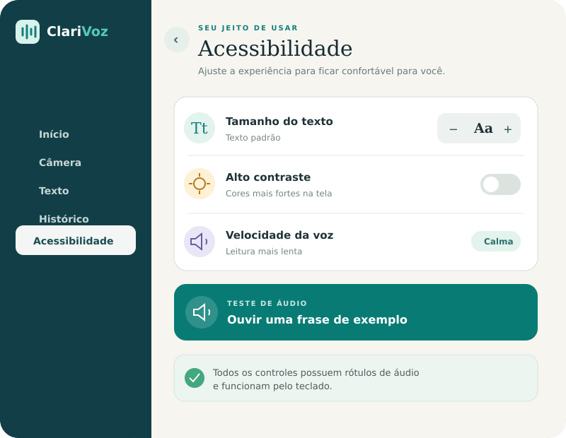

<div align="center">
  
  <h1>ClariVoz</h1>
  <p><strong>Tecnologia que transforma informação em autonomia.</strong></p>
  <p>
    <a href="https://geovannasilva15.github.io/clarivoz/">Abrir o protótipo</a>
    ·
    <a href="#funcionalidades">Funcionalidades</a>
    ·
    <a href="#executar-localmente">Executar localmente</a>
  </p>
</div>



## Sobre o projeto

O **ClariVoz** é um protótipo de tecnologia assistiva criado para facilitar o acesso à informação por pessoas com baixa alfabetização, dificuldades de leitura, idosos e usuários que preferem interações por voz.

Informações importantes ainda chegam em textos complexos, como receitas médicas, comunicados, formulários e orientações de serviços. O projeto propõe uma experiência acolhedora baseada em voz, linguagem simples e controles visuais acessíveis.

## Experiência do protótipo

| Linguagem simples | Preferências de acessibilidade |
| --- | --- |
|  |  |

## Funcionalidades

- Leitura da interface em voz alta;
- Seleção de imagem para demonstrar a leitura de documentos;
- Simplificação demonstrativa de textos complexos;
- Ditado por voz quando o navegador oferece suporte;
- Histórico de leituras e mensagens;
- Ajuste do tamanho do texto;
- Modo de alto contraste;
- Navegação responsiva para celular e computador;
- Suporte a teclado e preferência por movimento reduzido.

> A leitura de imagens e a simplificação são demonstrativas nesta versão. A integração com OCR e processamento de linguagem faz parte da evolução do produto.

## Tecnologias

- Next.js 16
- React 19
- TypeScript
- CSS responsivo
- Web Speech API
- GitHub Pages

## Executar localmente

Requisitos: Node.js 20 ou superior.

```bash
git clone https://github.com/geovannasilva15/clarivoz.git
cd clarivoz
npm install
npm run dev
```

Abra o endereço informado no terminal.

## Qualidade e acessibilidade

O projeto prioriza linguagem respeitosa, hierarquia visual clara, alvos de toque amplos, navegação por teclado, contraste configurável e controles com rótulos descritivos.

## Próximas etapas

- Integrar OCR para extrair texto real de imagens;
- Conectar um serviço de simplificação para linguagem clara;
- Permitir o uso offline das funções essenciais;
- Realizar testes de usabilidade com o público-alvo;
- Ampliar os controles de privacidade e exclusão de dados.

## Autoria

Desenvolvido por **Geovanna Eduarda da Silva** como projeto de impacto social, acessibilidade e tecnologia assistiva.

## Licença

Distribuído sob a licença MIT. Consulte [LICENSE](LICENSE).
