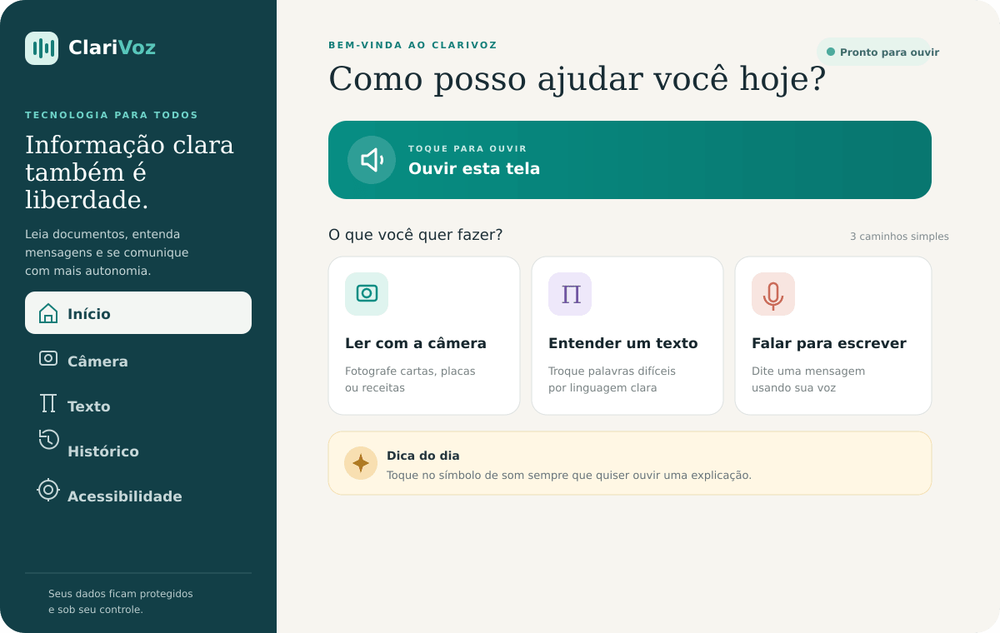
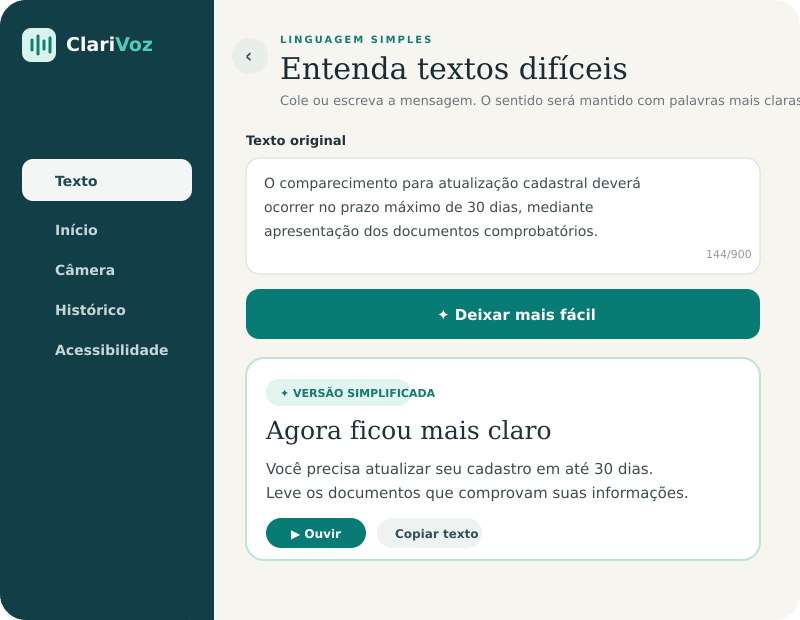
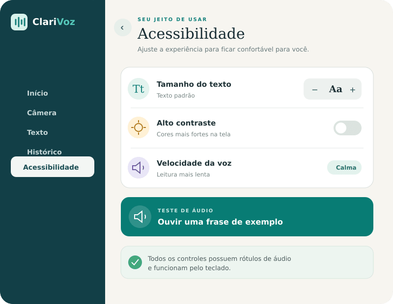

# ClariVoz

**Tecnologia que transforma informação em autonomia.**

[Acessar o protótipo](https://geovannasilva15.github.io/clarivoz/)

O ClariVoz é um protótipo de tecnologia assistiva pensado para pessoas com dificuldades de leitura ou compreensão de conteúdos digitais. A experiência reúne leitura em voz alta, simplificação de textos e ajustes visuais em uma interface direta.



## Funcionalidades

- leitura de textos em voz alta;
- simplificação de conteúdos complexos;
- controles de tamanho e contraste;
- navegação responsiva e por teclado;
- processamento demonstrativo sem cadastro obrigatório.

## Telas

| Texto simplificado | Recursos de acessibilidade |
|---|---|
|  |  |

## Tecnologias

`Next.js 16` `React 19` `TypeScript` `Tailwind CSS 4` `Web Speech API`

## Executar localmente

```bash
npm install
npm run dev
```

Acesse `http://localhost:3000`.

## Autoria

[Geovanna Eduarda da Silva](https://github.com/geovannasilva15)
